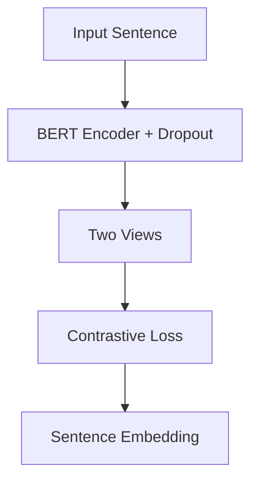

# ResearchCopilot: AI-Powered Agentic App for Research Papers

---

## 📖 Objective

Build a cross-platform iOS + macOS app called **ResearchCopilot**, which uses **agentic AI architecture** to:

* Parse research papers (PDF or arXiv URL)
* Generate structured summaries
* Extract methods, tech stack, pros/cons, and code
* Convert content into a dual-speaker podcast
* Visualize methods as flowcharts
* Provide text-to-speech in cloned user voice
* Allow voice commands (speech-to-text)
* Enable semantic search
* Export all results as a well-designed PDF

---

## 👥 Target Users

* Researchers, data scientists, students, analysts
* Users who learn better through audio and visuals
* Hands-free readers who want voice-based interaction

---

## 🎓 Key Functional Agents and Tools

### Agents (LLM-Powered)

| Agent Name           | Role                                               |
| -------------------- | -------------------------------------------------- |
| `SummaryAgent`       | Uses LLM to generate structured JSON summary       |
| `PodcastScriptAgent` | Writes dialogue script for two AI hosts            |
| `FlowchartAgent`     | Converts method section to Mermaid.js diagram      |
| `TTSAgent`           | Speaks summaries aloud (cloned or standard)        |
| `STTAgent`           | Accepts voice commands                             |
| `SearchAgent`        | Embedding-based semantic search engine             |
| `PDFExportAgent`     | Creates downloadable PDF of summary, diagram, etc. |
| `UIAgent`            | Manages content rendering in macOS/iOS UI          |

### Tools (Stateless, Non-LLM)

| Tool Name              | Role                                           |
| ---------------------- | ---------------------------------------------- |
| `PDFParserTool`        | Parses PDF or extracts from arXiv ID           |
| `ArxivAPIFetcher`      | Uses arXiv API to fetch abstract, metadata     |
| `SectionSplitterTool`  | Splits paper into intro, method, results, etc. |
| `GraphRAGTool`         | Builds knowledge graph from extracted content  |
| `WhisperSTTTool`       | Converts audio to text using whisper.cpp       |
| `XTTSVoiceSynthesizer` | Synthesizes speech with cloned user voice      |
| `MermaidRenderer`      | Converts Mermaid DSL to SVG or PNG             |
| `PDFKitTool`           | Generates PDF using iOS/macOS native PDFKit    |

---

## 🤖 Agentic AI Frameworks (Open Source)

| Framework     | Description                        |
| ------------- | ---------------------------------- |
| **LangGraph** | Graph-based agent flow controller  |
| **CrewAI**    | Collaborative multi-agent executor |
| **AutoGen**   | Agent chat coordination (optional) |

---

## 🧬 Recommended LLMs (All Open Source)

| Task                | Model                  |
| ------------------- | ---------------------- |
| Summarization       | Mistral-7B / Phi-2     |
| Dialogue Generation | Mixtral / OpenChat 3.5 |
| Flowchart DSL       | Zephyr / Mistral       |
| Embeddings (search) | bge-small / GTE-base   |
| Voice-to-Text       | whisper.cpp            |
| Text-to-Voice (TTS) | XTTS-v2 / Bark         |

---

## 🚀 System Architecture

```plaintext
[iOS/macOS App (SwiftUI)]
    |
    |-- Voice / PDF / arXiv Input
    |
[FastAPI Backend + LangGraph Agents]
    |
    |-- LLM Agents: Summary, Podcast, Flowchart
    |-- Tool Calls: PDF parsing, TTS, STT, GraphRAG
    |-- Local Inference (llama.cpp, whisper.cpp, XTTS)
    |
    |-- Output:
        ├── Summary JSON
        ├── Podcast Script + Audio
        ├── Mermaid Flowchart
        ├── Semantic Search Embeddings
        └── PDF Report
```

---

## 🔢 Core Flows

### 📖 Research Paper to Summary JSON

1. `PDFParserTool` or `ArxivAPIFetcher` extracts text
2. `SectionSplitterTool` divides sections
3. `GraphRAGTool` builds knowledge graph
4. `SummaryAgent` generates structured summary

### 🗞️ Generate Podcast

1. `PodcastScriptAgent` creates two-speaker script
2. `XTTSVoiceSynthesizer` creates voice for each speaker
3. `TTSAgent` packages audio and transcript

### 🌀 Generate Flowchart

1. `FlowchartAgent` outputs Mermaid DSL
2. `MermaidRenderer` converts to image for UI or PDF

### 🔒 Semantic Search

1. Chunks embedded using `SearchAgent`
2. Stored in FAISS vector DB
3. Queried on user input

### 📄 Export PDF Report

1. `PDFExportAgent` calls `PDFKitTool`
2. Merges:

   * Summary
   * Flowchart image
   * Transcript (optional)
   * Paper metadata

---

## 📲 iOS + 💻 macOS App Design (SwiftUI)

| Screen         | Components                                    |
| -------------- | --------------------------------------------- |
| Home           | Upload PDF / Enter arXiv / Voice Input        |
| Summary View   | Structured cards: abstract, method, pros/cons |
| Podcast Player | Play/pause, seek, transcript sync             |
| Flowchart View | Rendered Mermaid chart                        |
| Search View    | Input box, matched highlights                 |
| Export View    | PDF download or share                         |

---

## 📦 Deployment Plan

| Layer           | Tool                                  |
| --------------- | ------------------------------------- |
| Backend         | FastAPI + LangGraph                   |
| Local Inference | llama.cpp + whisper.cpp + XTTS        |
| Cloud Hosting   | Render / Fly.io / Hugging Face Spaces |
| iOS/macOS       | TestFlight + macOS Notarization       |

---

## 💰 Cost Optimization

* GPT-4 used only for override or premium mode
* Primary models are open-source (Mistral, XTTS, Whisper)
* Optional GPU backend (T4 or A100) for larger models
* Voice cloned only once, reused across episodes

---

## ⚡ Examples

### Mermaid Flowchart Example (LLM Output)



### Summary JSON Example

```json
{
  "title": "SimCSE: Contrastive Learning for Sentence Embeddings",
  "method": "Uses dropout noise to create two views of same sentence",
  "tech_stack": ["PyTorch", "Transformers"],
  "pros": ["No labeled data", "Simple setup"],
  "cons": ["Batch-size sensitive"],
  "code": "class SimCSEModel(nn.Module): ..."
}
```

---

## ✅ Next Steps

* [ ] Build LangGraph/CrewAI agent flows
* [ ] Scaffold iOS/macOS app with modular views
* [ ] Add audio synthesis and PDF export modules
* [ ] Integrate semantic search and local embedding index
* [ ] Launch TestFlight + macOS Beta
